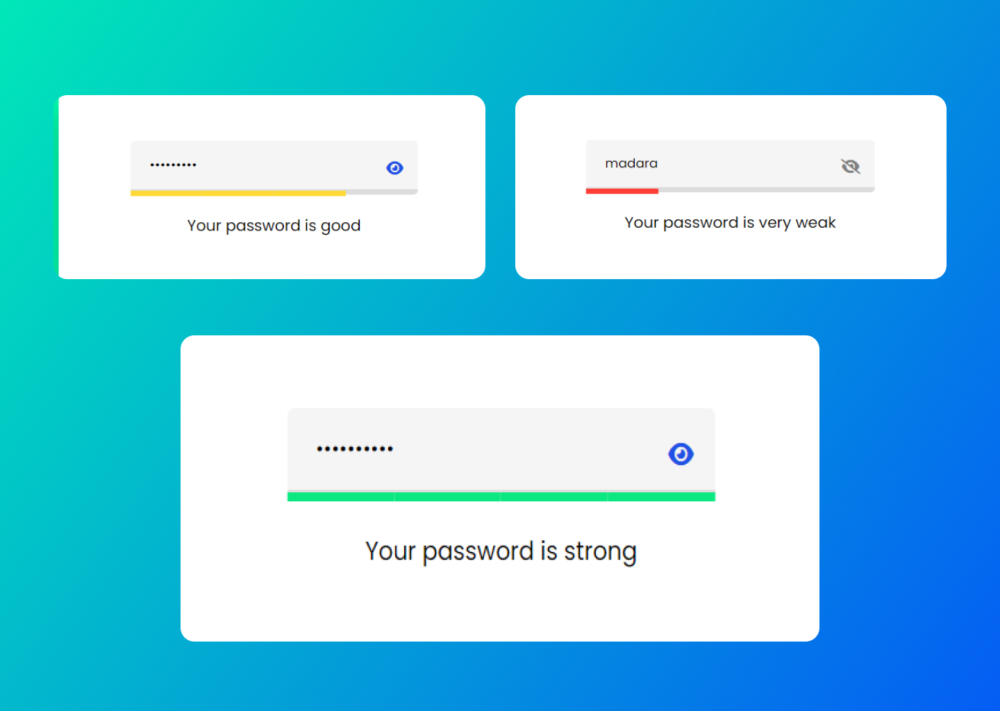

# JavaScript Password Strength Checker

This repository contains a password strength checker project built with HTML, CSS, and JavaScript. The goal of this project is to provide users with a visual representation of the strength of their passwords. The modern UI design and color indicators help users create secure and robust passwords.

## Preview



## Features

- Real-time password strength evaluation.
- Modern UI design with color indicators.
- Provides feedback on password strength to encourage users to create strong passwords.

## Getting Started

To use this password strength checker in your project, follow these steps:

1. Clone the repository to your local machine:

   ```bash
   git clone https://github.com/DevSethi3/Password-Strength-Checker.git
   ```

2. Include the necessary files in your project:

   - Copy the HTML, CSS, and JavaScript code from the `index.html`, `style.css`, and `script.js` files into your project.
   - Link these files in your HTML file:

     ```html
     <link rel="stylesheet" href="path/to/style.css">
     <script src="path/to/script.js"></script>
     ```

3. Customize the design and integrate the password strength checker into your project.

## Customization

You can customize the password strength checker by modifying the HTML, CSS, and JavaScript files. Adjust the styles, colors, and strength evaluation criteria to match your project's requirements.

## Contributing

If you'd like to contribute to this project, please follow these steps:

1. Fork the repository.
2. Create a new branch for your feature or improvement.
3. Make your changes and commit them with descriptive messages.
4. Push your changes to your forked repository.
5. Open a pull request to merge your changes into the main branch.

Feel free to integrate this modern password strength checker into your projects, provide feedback, or contribute to its development. Thank you for checking out the JavaScript Password Strength Checker repository!